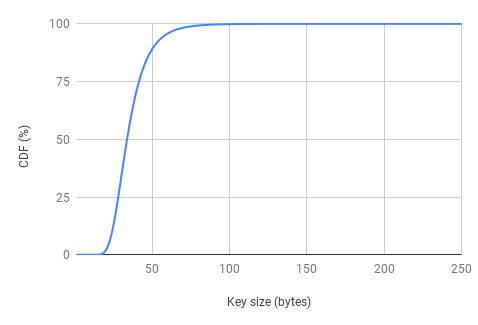
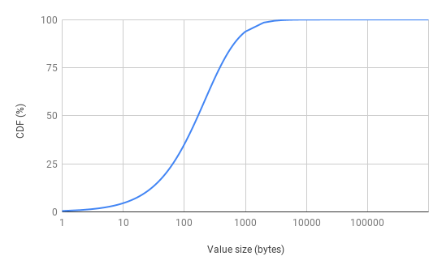

# fbworkload
This project generates a social networking workload based on published stats by Facebook [1, 2]. Berk et al. [1] provides statistical modelings of key-size, value-size, and inter-arrival gap distributions. Yuehai et al. [2] extends [1] by presenting more analysis results on cache misses.

[1] Berk Atikoglu, Yuehai Xu, Eitan Frachtenberg, Song Jiang, and Mike Paleczny. 2012. Workload analysis of a large-scale key-value store. In Proceedings of the 12th ACM SIGMETRICS/PERFORMANCE joint international conference on Measurement and Modeling of Computer Systems (SIGMETRICS '12). ACM, New York, NY, USA, 53-64. DOI=http://dx.doi.org/10.1145/2254756.2254766

[2] Yuehai Xu, Eitan Frachtenberg, Song Jiang, Mike Paleczny: Characterizing Facebook's Memcached Workload. IEEE Internet Computing 18(2): 41-49 (2014)

## Example command to generate a trace. 
trace_specification.properties specifies input parameters. The program writes generated traces to /tmp/fb-trace.
```
java -jar tracegen.jar trace_specification.properties /tmp/fb-trace
```
## Input
<table>
  <tr>
    <td><strong>Parameter</strong></td>
    <td><strong>Value</strong></td>
    <td><strong>Description</strong></td>
  </tr>
  <tr>
    <td>read</td>
    <td>A value between 0.0 to 1.0</td>
    <td>The percentage of read requests in the generated trace</td>
  </tr>
  <tr>
    <td>replace</td>
    <td>A value between 0.0 to 1.0</td>
    <td>The percentage of replace requests in the generated trace</td>
  </tr>
  <tr>
    <td>update</td>
    <td>A value between 0.0 to 1.0</td>
    <td>The percentage of update requests in the generated trace</td>
  </tr>
  <tr>
    <td>items</td>
    <td>A positive integer</td>
    <td>The total number of keys</td>
  </tr>
  <tr>
    <td>requests</td>
    <td>A positive integer</td>
    <td>The total number of requests</td>
  </tr>
</table>

### Built-in Distributions
<table>
  <tr>
    <td>Name</td>
    <td>Distribution</td>
    <td>Value Range</td>
  </tr>
  <tr>
    <td>Key size (bytes)</td>
    <td>Generalized Extreme Value Distribution (location=30.7984, scale=8.20449, shape=0.078688) [1]</td>
    <td>[1, 250]</td>
  </tr>
  <tr>
    <td>Value size (bytes)</td>
    <td>Generalized Pareto Distribution (location=0, scale=214.476, shape=0.348238) [1]</td>
    <td>[1, 1,000,000]</td>
  </tr>
  <tr>
    <td>Inter-arrival time (microseconds)</td>
    <td>Generalized Pareto Distribution  (location=0, scale=16.0292, shape=0.154971) [1]</td>
    <td>[1, 1000]</td>
  </tr>
</table>

The sum of probabilities of the above distributions is less than 100% since they impose a maximum limit. We increase the probability for the distribution’s mean such that the sum of probabilities becomes 100%. 

Value size distribution: we use the generalized pareto distribution for the entire value range since the sum exceeds 100% if we include the provided probabilities of the first 14 bytes [1].

The trace is generated with a Zipfian distribution (alpha=100). The following figures show the generated distributions, which resemble CDF graphs of Figure 8 in [1].

 



## Output
The generated trace is in the following format. 
<table>
  <tr>
    <td>Operation</td>
        <td>Key</td>
        <td>Key size (bytes)</td>
        <td>Value size (bytes)</td>
        <td>Timestamp (microseconds)</td>
  </tr>
</table>
Operation is one of:  {READ, REPLACE, DELETE}. This is an example output. It represents a read request on key 10499 at 12 microseconds relative to the first request. Its referenced key size is 58 bytes and the value size is 9 bytes. 

```
READ,10499,58,9,12
```


