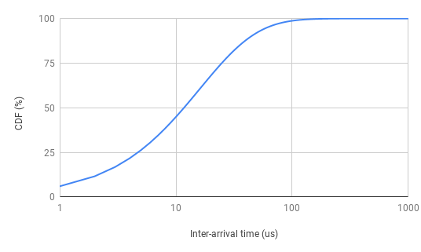

# Hoagie: A Database and Workload Generator using Published Specifications 
Hoagie is a plug-n-play workload and database generator to evaluate novel system architectures, design decisions, protocols, and algorithms. It uses published specifications to create a database of data items and a workload that references these data items. Hoagie's modular design enables an experimentalist to use it either offline or online. In offline mode, Hoagie outputs a trace file that can be used to issue requests to a target system. In online mode, Hoagie is plugged into an existing benchmark that invokes it to generate requests one at a time to its target system.

## Example command to generate a trace
trace_specification.properties specifies input parameters. The program writes generated traces to /tmp/output. Its main function is in https://github.com/scdblab/fbworkload/blob/bpod18/db/edu/usc/tracegen/TraceMain.java
```
java -jar hoagie-trace-client.jar trace_specification.properties /tmp/output
```
### Input
<table>
  <tr>
    <td><strong>Parameter</strong></td>
    <td><strong>Value</strong></td>
    <td><strong>Description</strong></td>
  </tr>
  <tr>
    <td>read</td>
    <td>A value between 0.0 to 1.0</td>
    <td>The percentage of read requests in the generated trace</td>
  </tr>
  <tr>
    <td>replace</td>
    <td>A value between 0.0 to 1.0</td>
    <td>The percentage of replace requests in the generated trace</td>
  </tr>
  <tr>
    <td>update</td>
    <td>A value between 0.0 to 1.0</td>
    <td>The percentage of update requests in the generated trace</td>
  </tr>
  <tr>
    <td>hours</td>
    <td>A positive integer</td>
    <td>The total number of hours to generate requests</td>
  </tr>
  <tr>
    <td>seed</td>
    <td>A integer</td>
    <td>The seed used in the random generator. Hoagie generates the same sequence of requests given the same seed.</td>
  </tr>
  <tr>
    <td>zipf</td>
    <td>A positive double value</td>
    <td>The zipfian contant that controls the popularity skew.</td>
  </tr>
</table>

### Built-in Distributions
Hoaige generates traces based on stats published by Facebook [1].

[1] Berk Atikoglu, Yuehai Xu, Eitan Frachtenberg, Song Jiang, and Mike Paleczny. 2012. Workload analysis of a large-scale key-value store. In Proceedings of the 12th ACM SIGMETRICS/PERFORMANCE joint international conference on Measurement and Modeling of Computer Systems (SIGMETRICS '12). ACM, New York, NY, USA, 53-64. DOI=http://dx.doi.org/10.1145/2254756.2254766
<table>
  <tr>
    <td>Name</td>
    <td>Distribution</td>
    <td>Value Range</td>
  </tr>
  <tr>
    <td>Key size (bytes)</td>
    <td>Generalized Extreme Value Distribution (location=30.7984, scale=8.20449, shape=0.078688) [1]</td>
    <td>[1, 250]</td>
  </tr>
  <tr>
    <td>Value size (bytes)</td>
    <td>Generalized Pareto Distribution (location=0, scale=214.476, shape=0.348238) [1]</td>
    <td>[1, 1,000,000]</td>
  </tr>
  <tr>
    <td>Inter-arrival time (microseconds)</td>
    <td>Generalized Pareto Distribution  (location=0, scale=16.0292, shape=0.154971) [1]</td>
    <td>[1, 1000]</td>
  </tr>
</table>

The sum of probabilities of the above distributions is less than 100% since they impose a maximum limit. We increase the probability for the distribution’s mean such that the sum of probabilities becomes 100%. 

Value size distribution: we use the generalized pareto distribution for the entire value range since the sum exceeds 100% if we include the provided probabilities of the first 14 bytes [1].

The trace is generated with a Zipfian distribution (alpha=100). The following figures show the generated distributions, which resemble CDF graphs of Figure 8 in [1].

 



### Output
The generated trace is in the following format. 
<table>
  <tr>
    <td>Operation</td>
        <td>Key</td>
        <td>Key size (bytes)</td>
        <td>Value size (bytes)</td>
        <td>Timestamp (microseconds)</td>
  </tr>
</table>
Operation is one of:  {READ, REPLACE, DELETE}. This is an example output. It represents a read request on key 10499 at 12 microseconds relative to the first request. Its referenced key size is 58 bytes and the value size is 9 bytes. 

```
READ,10499,58,9,12
```
## Example command to evaluate an LRU cache
trace_specification.properties specifies input parameters. Its main function is in https://github.com/scdblab/fbworkload/blob/bpod18/db/edu/usc/cache/LRUCacheMain.java
```
java -jar hoagie-lru-cache-client.jar trace_specification.properties
```
### Output
It outputs cache stats after processing 1-second requests. 
<table>
  <tr>
    <td>Term</td>
    <td>Definition</td>
  </tr>
  <tr>
    <td>seconds</td>
    <td>The number of seconds of requests that have been processed.</td>
  </tr>
  <tr>
    <td>misses</td>
    <td>The number of misses within this second.</td>
  </tr>
  <tr>
    <td>reads</td>
    <td>The number of reads within this second.</td>
  </tr>
  <tr>
    <td>num-entries-in-cache</td>
    <td>The number of entries in the LRU cache within this second.</td>
  </tr>
  <tr>
    <td>evictions</td>
    <td>The number of evictions within this second.</td>
  </tr>
  <tr>
    <td>miss-ratio</td>
    <td>The number of misses divided by the number of reads within this second.</td>
  </tr>
  <tr>
    <td>evict-miss-ratio</td>
    <td>The number of evictions divided by the number of misses within this second.</td>
  </tr>
</table>
This is an example output.

```
seconds,misses,reads,num-entries-in-cache,evictions,miss-ratio,evict-miss-ratio
1,32328,47996,2810,28688,0.6736,0.8874
```

